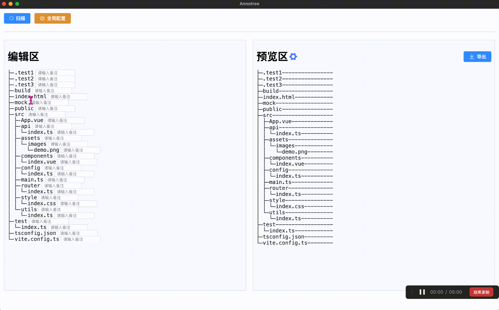
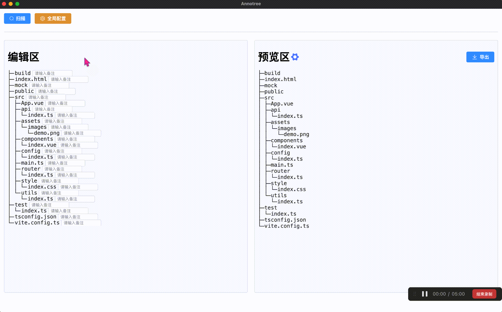
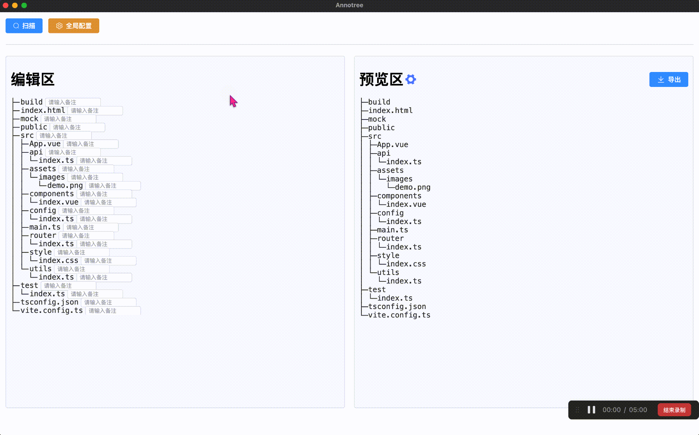
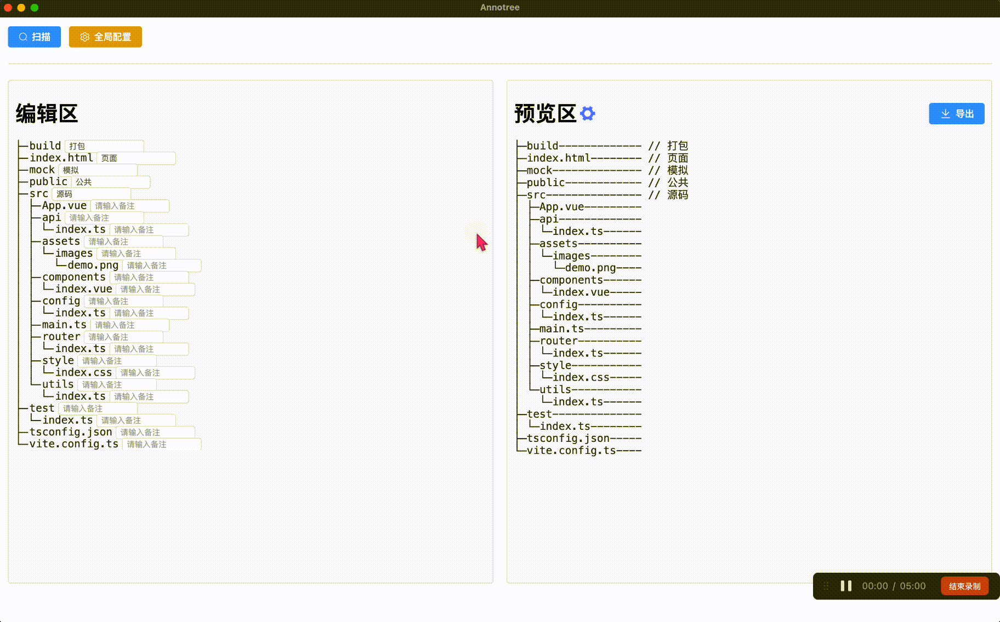
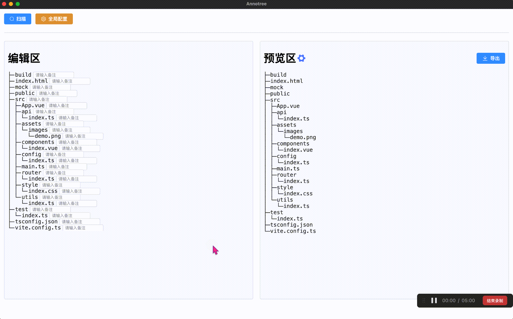

# 功能介绍

> 视频讲解 🎉：https://www.bilibili.com/video/BV1fS421R7UM  
> 这是我在 B 站发布的第 2 个技术视频，如果对你有帮助的话，感谢一键三连，加关注~ 💗

## 扫描

> 点击扫描按钮后打开文件选择器，选择需要扫描的文件夹，即可开始扫描。

## 全局配置

### 自动打开文件

> 导出文件后自动打开。

### 忽略文件夹

> 忽略不需要扫描的文件夹，避免性能损失甚至程序失去响应，比如：node_modules 文件夹，程序内部已自动忽略 node_modules 文件夹。

### 忽略以 "." 开头的文件夹

> 这类文件夹在 MacOS 和 Linux 上是默认隐藏的文件夹。

### 只扫描文件夹

> 忽略所有文件，只扫描文件夹。

### 忽略以 "." 开头的文件

> 这类文件在 MacOS 和 Linux 上是默认隐藏的文件。

### 忽略文件类型

> 在扫描一次后，会生成此次扫描后的所有文件类型，可以选择忽略不需要的文件类型，以提高扫描效率。

### 扫描深度

> 设置扫描目录的深度，0 为所有深度，每递增一个数字则代表扫描深度 +1。

### 默认名称

> 导出文本的默认名称配置。

## 预览区配置

### 注释格式化

> 填充注释的格式

### 桥梁最短字符数

> 路径最长的地方，显示的桥梁字符数

### 桥梁填充字符

> 输入一个单字节填充字符，比如：\*，\#，\$，\-，\@，\_ 等。

### 始终显示桥梁

> 配置没有注释的地方是否显示桥梁。

## 导出

> 设置好相关配置，编写好注释后，导出注释目录树。

